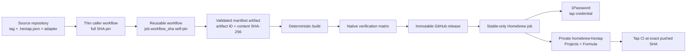

# Hextap release architecture

Status: release platform published; self-development orchestration is under
review on an isolated toolkit feature branch.

## Components and trust boundaries

The source repository owns its tag, schema-1 manifest, trusted build adapter,
thin caller, source rulesets, and the single secret name
`OP_SERVICE_ACCOUNT_TOKEN`. The toolkit owns validation, artifact production,
native verification, immutable release publication, and Formula metadata
updates. The private tap owns the canonical `Projects/<formula>.json` registry,
`Formula/<formula>.rb`, and its test workflow.

The adapter is trusted source code, not a sandbox. It receives a minimized
environment with no publication credential and runs only in the unprivileged
build job. The only job that receives the 1Password service-account token is
the Homebrew publication job, after assets and the carried manifest have been
reverified.

## Release data flow

1. The caller references the reusable workflow by the full commit SHA of a
   reviewed stable toolkit release. The stable `vX.Y.Z` tag is retained as
   provenance in the generated caller.
2. Each reusable job checks out `SijanC147/hextap-toolkit` at
   `job.workflow_sha`, the server-resolved commit containing that job's
   workflow definition. It never re-resolves mutable `main`.
3. Validation resolves the requested source tag, requires it to be on canonical
   `origin/main`, detaches the checkout, and copies the tracked manifest before
   parsing it. The exact validated bytes are uploaded once.
4. Every consumer downloads that manifest by immutable artifact ID and checks
   its explicit content SHA-256. Build, native verification, release
   publication, and Homebrew recovery therefore use one manifest identity.
5. Full mode runs source quality, deterministic cross-builds, native execution,
   asset attestation, draft publication, and immutable-release verification.
   Prereleases stop after GitHub publication. Stable releases may continue to
   Homebrew.
6. `homebrew-only` is a stable-only recovery path. It requires an existing
   verified immutable release, republishes no GitHub assets, and is available
   only while that tag's source manifest still equals the current tap
   registration. Registry evolution can intentionally close recovery for an
   older tag.
7. The Homebrew publisher requires full semantic equality between the carried
   source manifest and the tap registration. It derives asset names from that
   registration, changes only Formula URL/SHA metadata, pushes tap `main`
   without force, and waits for the tap test workflow at the exact pushed SHA.

Schema 2 extends this graph without adding another publisher. The validated
manifest selects pinned Bun setup, direct project-owned quality/preparation
argv, explicit targets, and packaging per target. One adapter executable may
produce a raw asset, a canonical archive, or both; both representations must be
byte-identical. Windows amd64 is verified as PE32+ and executed on a Windows
runner. A named tap-owned Formula profile keeps nonmetadata Ruby outside source
while the publisher still patches only the two Darwin URLs and SHA-256 values.
Build preparation warms a fresh explicit Bun runtime cache with one private
probe per declared target. The Ubuntu asset build then drops back to the runner
user inside a root-created network namespace, making the warmed cache the only
available runtime source. Toolkit CI proves empty-cache failure and warmed-cache
five-target success for this boundary.

Schema 1 intentionally has neither field exceptions nor versioned tap
registries. A historical `homebrew-only` request outside the equality window
fails with `tap/source manifest mismatch` before any Formula change. In
particular, `claude-rc-proxy v0.1.0` is outside the window after the XDG-aware
caveat evolution; the next aligned stable tag is the recovery proof target.

## Command architecture

`hextapctl` is the deterministic, network-free engine built from the pinned
toolkit source inside reusable jobs. `brew-hextap` is the installable external
command that Homebrew exposes as `brew hextap`; it provides local onboarding,
validation, optional read-only GitHub diagnostics, managed portable skills, and
an explicit self-development state machine.

Onboarding renders seven local artifacts, preflights every managed path, and
uses a rooted, staged, create-only transaction. It never sets a secret, applies
a ruleset, changes the tap, commits, or pushes. The generated `SETUP.md` is the
review boundary for those owner-controlled operations.

For the initial toolkit `v0.1.0` distribution, the one-executable archive
contains `brew-hextap` only. `hextapctl` remains source-built; multi-binary
archive support is intentionally outside this initiative.

The `dev` surface wraps the toolkit repository's existing contracts instead of
duplicating release policy in agent prompts. Read-only status and planning are
separate from trusted-code validation, protected PR/release mutation, and local
Homebrew/skill mutation. Remote commands require `--execute` plus the exact
computed tag; local installation remains separately explicit. The state machine
never bypasses protection or resolves review feedback.

## Verification layers

- Unit and integration tests validate strict JSON, deterministic archives,
  Formula rendering/updating, workflow contracts, publisher retry behavior,
  onboarding transactions, fake-`gh` online doctor flows, and native process
  limits.
- `actionlint` 1.7.12 predates two current GitHub schema additions. The
  repository checker requires its exact nonzero one-plus-six known diagnostics
  and rejects a clean/no-op or anything else. A future checker upgrade must
  change the pinned expectation in a reviewed PR.
- Hosted runners, immutable-release settings, 1Password authorization, direct
  tap write scope, and real tap CI remain live gates. Static green tests are not
  reported as live publication proof.
